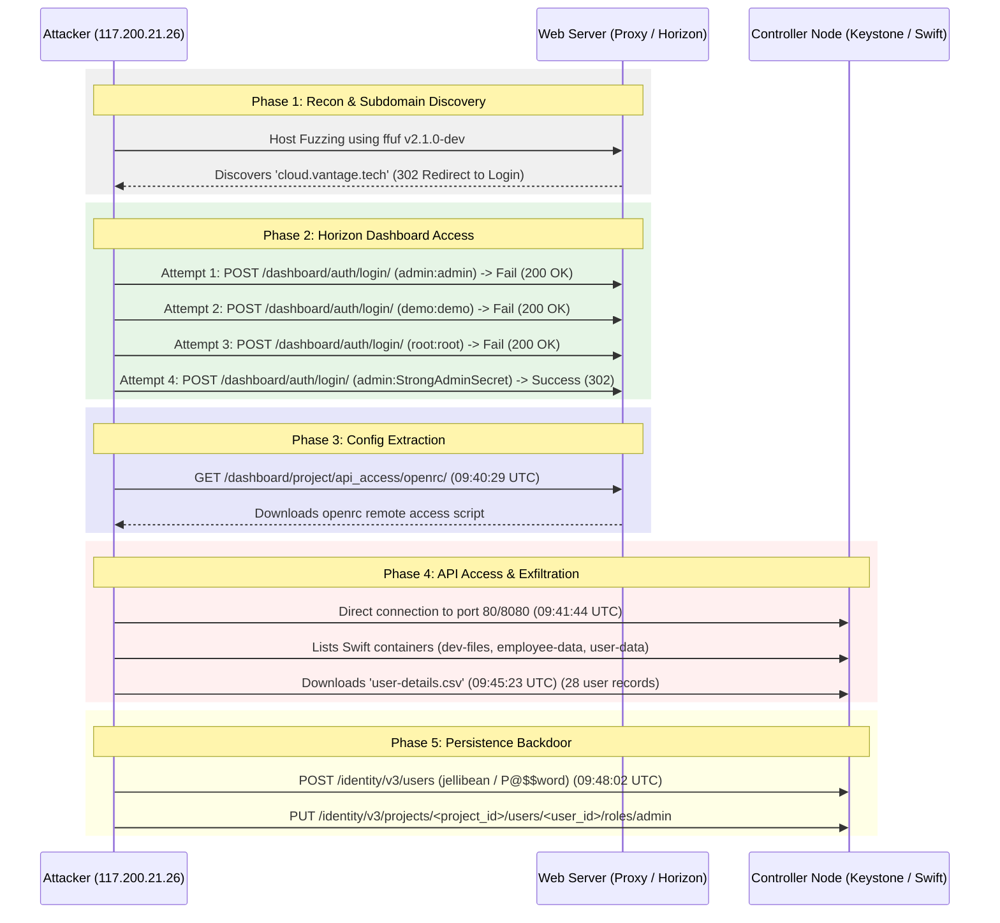

# Vantage Incident Investigation Notes

> [!NOTE]  
> This document summarizes the forensic investigation of the OpenStack cloud installation following reports of a user data leak. It is compiled from analysis of the packet captures:
> - [web-server.2025-07-01.pcap](file:///home/white/white/Documents/htb/Vantage/web-server.2025-07-01.pcap)
> - [controller.2025-07-01.pcap](file:///home/white/white/Documents/htb/Vantage/controller.2025-07-01.pcap)

---

## 1. Incident Timeline & Attack Flow

The attack progressed from initial host header fuzzing, to dashboard exploitation, to API config theft, and finally direct object storage exfiltration and backdoor persistence.

---

## 2. Technical Breakdown

### A. Reconnaissance & Host Header Fuzzing
- **Tooling**: The attacker utilized `ffuf@2.1.0` (User-Agent: `Fuzz Faster U Fool v2.1.0-dev`).
- **Discovery**: Host header fuzzing of `vantage.tech` successfully identified the `cloud.vantage.tech` subdomain (which resolves internally to the OpenStack Horizon web panel).

### B. Horizon Dashboard Exploitation
- **Brute Force**: The attacker initiated credential guessing against the login page at `/dashboard/auth/login/`.
- **Attempts**: 
  1. `admin` : `admin` (Failed)
  2. `demo` : `demo` (Failed)
  3. `root` : `root` (Failed)
  4. `admin` : `StrongAdminSecret` (Successful redirect to `/dashboard/` at **09:40:07 UTC**)
- **Impact**: Attacker successfully logged in as the OpenStack `admin` user.

### C. OpenRC Config File Leak
- **Action**: Immediately after logging in, the attacker navigated to the API Access tab and triggered a download of the OpenStack API remote access configuration script (`openrc`).
- **Timestamp**: **2025-07-01 09:40:29 UTC**
- **Impact**: Exposed the admin credentials, project identifiers, and API endpoint URLs to the attacker, allowing them to interact directly with the OpenStack API from their own machine without using Horizon.

### D. Object Storage (Swift) Exfiltration
- **Direct API Contact**: At **2025-07-01 09:41:44 UTC**, the attacker bypassed the Horizon dashboard and interacted directly with Keystone (port 80) and Swift (port 8080) on the controller node (`134.209.71.220`).
- **Container Discovery**: Attacker queried the Swift endpoint and enumerated three containers:
  1. `dev-files`
  2. `employee-data`
  3. `user-data`
- **Data Exfiltration**: At **2025-07-01 09:45:23 UTC**, the attacker issued a `GET` request to `/v1/AUTH_9fb84977ff7c4a0baf0d5dbb57e235c7/user-data/user-details.csv`.
- **Sensitive Content**: The file `user-details.csv` contained exactly **28 user records** (excluding the CSV header line), containing full names, emails, and phone numbers.

### E. Persistence via Backdoor Admin Account
- **Action**: To establish a persistent backdoor, the attacker interacted with Keystone's `/identity/v3/users` endpoint.
- **Account Created**:
  - **Username**: `jellibean`
  - **Password**: `P@$$word`
  - **Project ID**: `9fb84977ff7c4a0baf0d5dbb57e235c7`
- **Escalation**: Attacker granted the newly created user the `admin` role by executing a `PUT` request to `/identity/v3/projects/9fb84977ff7c4a0baf0d5dbb57e235c7/users/c373da67a62b48f393c45dc071fa80b8/roles/0501401642464242bcd799437b71bdc9`.

---

## 3. Indicators of Compromise (IoC) & Key Findings

| Attribute | Value | Description |
| :--- | :--- | :--- |
| **Attacker IP** | `117.200.21.26` | External source IP of the attacker |
| **Controller IP** | `134.209.71.220` | Internal IP of the OpenStack Controller Node |
| **Target Subdomain** | `cloud.vantage.tech` | Discovered Horizon Dashboard endpoint |
| **Compromised Admin PW** | `StrongAdminSecret` | Exposed administrator password |
| **Project ID** | `9fb84977ff7c4a0baf0d5dbb57e235c7` | Target project ID |
| **Swift Endpoint** | `http://134.209.71.220:8080/v1/AUTH_9fb84977ff7c4a0baf0d5dbb57e235c7` | Swift service endpoint URL |
| **Backdoor Username** | `jellibean` | Rogue user created for persistence |
| **Backdoor Password** | `P@$$word` | Password set for the backdoor user |

---

## 4. MITRE ATT&CK Mapping

| Tactic | Technique ID | Technique / Sub-technique Name | Description |
| :--- | :--- | :--- | :--- |
| **Reconnaissance** | `T1590` | Gather Victim Network Information | Fuzzing domains/subdomains to discover web interfaces |
| **Credential Access**| `T1110.001` | Brute Force: Password Guessing | Guessing credentials on Horizon login interface |
| **Credential Access**| `T1552` | Unsecured Credentials | Downloading the `openrc` script which leaks API tokens/credentials |
| **Exfiltration** | `T1567` | Exfiltration Over Web Service | Exfiltrating CSV files over Swift HTTP API |
| **Persistence** | `T1136.003` | Create Account: Cloud Account | Registering the `jellibean` user in Keystone with admin privileges |
